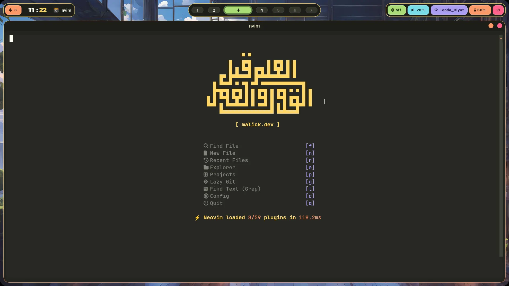
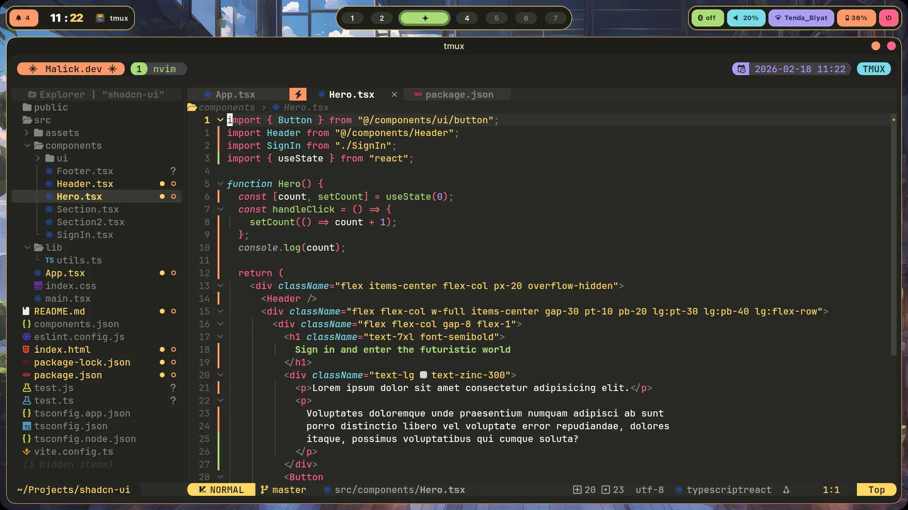
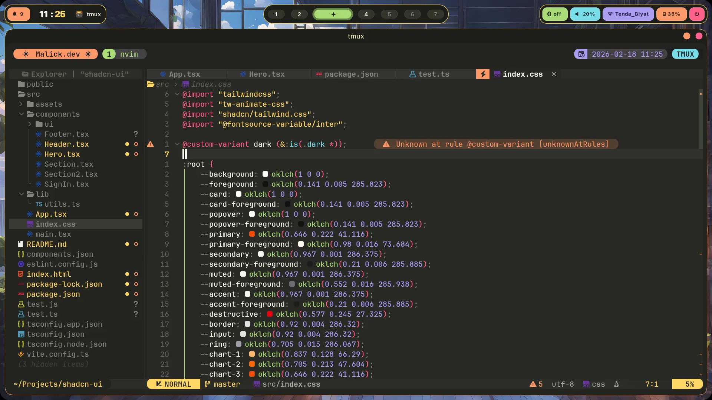
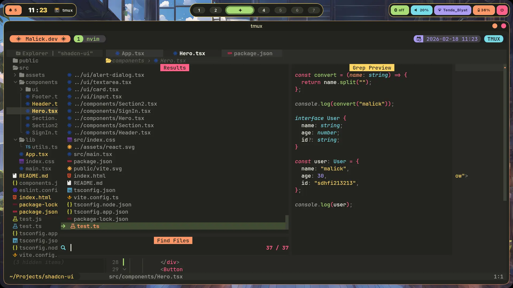
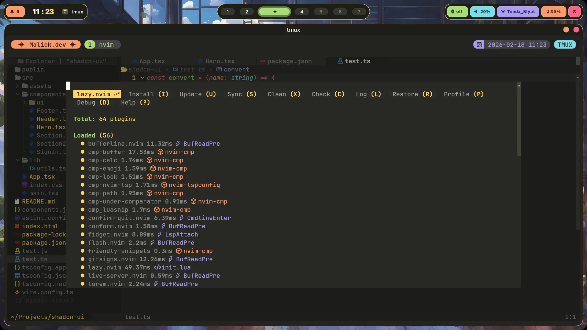
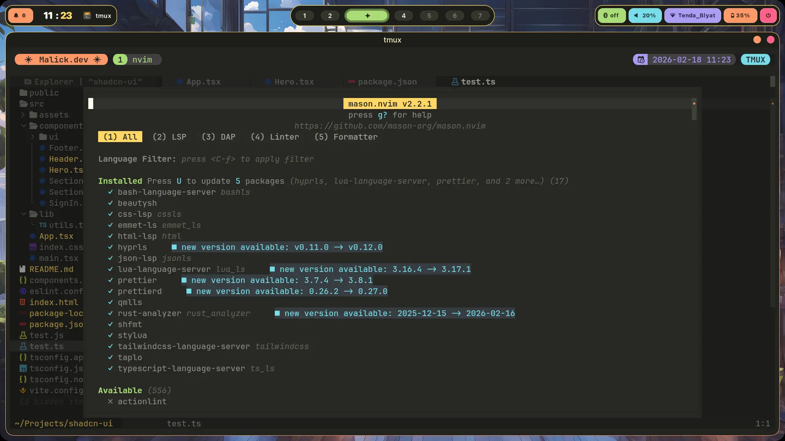
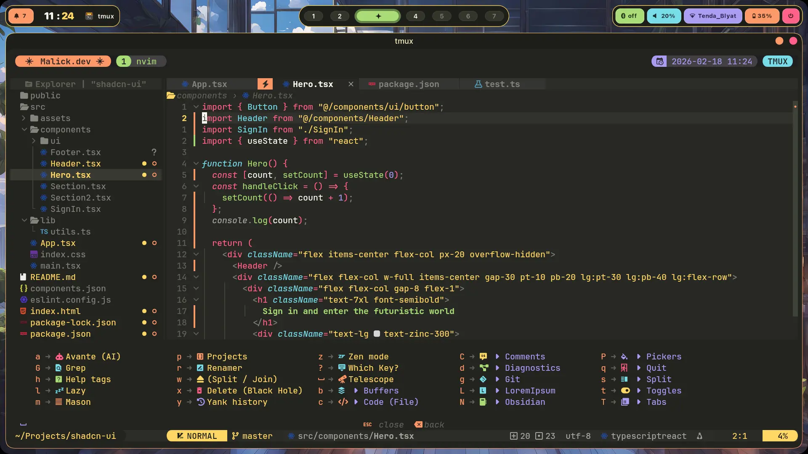

<div align="center"><h1> * Monokai Neovim * </h1></div>

<div align="center">
This is my personal Neovim config ( clean and produactive )</br>
made for web development mainly and software development secondary
</div>

</br>

<div align="center" style="display: flex; justify-content: space-evenly; gap: 10;">
  <a href="https://dotfyle.com/Malick-Tammal/monokai-neovim">
    
  </a>
  
  <a href="https://dotfyle.com/Malick-Tammal/monokai-neovim">
    
  </a>
  
  <a href="https://dotfyle.com/Malick-Tammal/monokai-neovim">
    
  </a>

  <a href="https://github.com/Malick-Tammal/monokai-neovim">
    
  </a>
</div>

---

<div align="center">

## - Previews -

</div>

Welcome page (snacks dashboard)



Editor



Editor 2



Telescope



Lazyvim (Plugins manager)



Mason (lsp's / formatters manager)



Whichkey (keymaps viewer)



Project picker (I made it to easy hook up to project)


<div align="center">

## - Features -

</div>

### LSPs :

- lua
- javascript / typescript
- css
- html
- tailwindcss
- emmet
- json / jsonc
- rust
- bash / zsh
- hyprland
- qml

### Formatters :

- lua
- javascript / typescript
- css
- html
- tailwindcss
- emmet
- json / jsonc
- rust
- bash / zsh
- qml

### UI :

- monokai theme (Heavily modified)
- polished ui

and more ...

<div align="center">

## - Plugins -

</div>

### ai :

- [yetone/avante.nvim](https://dotfyle.com/plugins/yetone/avante.nvim)

### animation :

- [sphamba/smear-cursor.nvim](https://dotfyle.com/plugins/sphamba/smear-cursor.nvim)

### color :

- [nvzone/minty](https://dotfyle.com/plugins/nvzone/minty)
- [catgoose/nvim-colorizer.lua](https://dotfyle.com/plugins/catgoose/nvim-colorizer.lua)

### colorscheme :

- [loctvl842/monokai-pro.nvim](https://dotfyle.com/plugins/loctvl842/monokai-pro.nvim)

### comment :

- [folke/todo-comments.nvim](https://dotfyle.com/plugins/folke/todo-comments.nvim)

### completion :

- [zbirenbaum/copilot.lua](https://dotfyle.com/plugins/zbirenbaum/copilot.lua)
- [lukas-reineke/cmp-under-comparator](https://dotfyle.com/plugins/lukas-reineke/cmp-under-comparator)
- [hrsh7th/nvim-cmp](https://dotfyle.com/plugins/hrsh7th/nvim-cmp)

### editing-support :

- [Wansmer/treesj](https://dotfyle.com/plugins/Wansmer/treesj)
- [windwp/nvim-autopairs](https://dotfyle.com/plugins/windwp/nvim-autopairs)
- [gbprod/yanky.nvim](https://dotfyle.com/plugins/gbprod/yanky.nvim)
- [nvim-treesitter/nvim-treesitter-context](https://dotfyle.com/plugins/nvim-treesitter/nvim-treesitter-context)
- [folke/snacks.nvim](https://dotfyle.com/plugins/folke/snacks.nvim)
- [windwp/nvim-ts-autotag](https://dotfyle.com/plugins/windwp/nvim-ts-autotag)

### file-explorer :

- [nvim-neo-tree/neo-tree.nvim](https://dotfyle.com/plugins/nvim-neo-tree/neo-tree.nvim)

### formatting :

- [stevearc/conform.nvim](https://dotfyle.com/plugins/stevearc/conform.nvim)

### fuzzy-finder :

- [nvim-telescope/telescope.nvim](https://dotfyle.com/plugins/nvim-telescope/telescope.nvim)
- [ibhagwan/fzf-lua](https://dotfyle.com/plugins/ibhagwan/fzf-lua)

### git :

- [lewis6991/gitsigns.nvim](https://dotfyle.com/plugins/lewis6991/gitsigns.nvim)

### icon :

- [kyazdani42/nvim-web-devicons](https://dotfyle.com/plugins/kyazdani42/nvim-web-devicons)

### keybinding :

- [folke/which-key.nvim](https://dotfyle.com/plugins/folke/which-key.nvim)

### lsp :

- [j-hui/fidget.nvim](https://dotfyle.com/plugins/j-hui/fidget.nvim)
- [onsails/lspkind.nvim](https://dotfyle.com/plugins/onsails/lspkind.nvim)
- [neovim/nvim-lspconfig](https://dotfyle.com/plugins/neovim/nvim-lspconfig)
- [nvimdev/lspsaga.nvim](https://dotfyle.com/plugins/nvimdev/lspsaga.nvim)
- [rachartier/tiny-inline-diagnostic.nvim](https://dotfyle.com/plugins/rachartier/tiny-inline-diagnostic.nvim)

### lsp-installer :

- [williamboman/mason.nvim](https://dotfyle.com/plugins/williamboman/mason.nvim)

### markdown-and-latex :

- [MeanderingProgrammer/render-markdown.nvim](https://dotfyle.com/plugins/MeanderingProgrammer/render-markdown.nvim)

### media :

- [HakonHarnes/img-clip.nvim](https://dotfyle.com/plugins/HakonHarnes/img-clip.nvim)

### motion :

- [folke/flash.nvim](https://dotfyle.com/plugins/folke/flash.nvim)

### note-taking :

- [epwalsh/obsidian.nvim](https://dotfyle.com/plugins/epwalsh/obsidian.nvim)

### nvim-dev :

- [MunifTanjim/nui.nvim](https://dotfyle.com/plugins/MunifTanjim/nui.nvim)
- [nvim-lua/plenary.nvim](https://dotfyle.com/plugins/nvim-lua/plenary.nvim)

### plugin-manager :

- [folke/lazy.nvim](https://dotfyle.com/plugins/folke/lazy.nvim)

### scrollbar :

- [petertriho/nvim-scrollbar](https://dotfyle.com/plugins/petertriho/nvim-scrollbar)

### scrolling :

- [karb94/neoscroll.nvim](https://dotfyle.com/plugins/karb94/neoscroll.nvim)

### snippet :

- [rafamadriz/friendly-snippets](https://dotfyle.com/plugins/rafamadriz/friendly-snippets)
- [L3MON4D3/LuaSnip](https://dotfyle.com/plugins/L3MON4D3/LuaSnip)

### statusline :

- [nvim-lualine/lualine.nvim](https://dotfyle.com/plugins/nvim-lualine/lualine.nvim)

### syntax :

- [nvim-treesitter/nvim-treesitter-textobjects](https://dotfyle.com/plugins/nvim-treesitter/nvim-treesitter-textobjects)
- [nvim-treesitter/nvim-treesitter](https://dotfyle.com/plugins/nvim-treesitter/nvim-treesitter)

### tabline :

- [akinsho/bufferline.nvim](https://dotfyle.com/plugins/akinsho/bufferline.nvim)

### utility :

- [echasnovski/mini.nvim](https://dotfyle.com/plugins/echasnovski/mini.nvim)
- [folke/noice.nvim](https://dotfyle.com/plugins/folke/noice.nvim)
- [yutkat/confirm-quit.nvim](https://dotfyle.com/plugins/yutkat/confirm-quit.nvim)
- [rcarriga/nvim-notify](https://dotfyle.com/plugins/rcarriga/nvim-notify)
- [sitiom/nvim-numbertoggle](https://dotfyle.com/plugins/sitiom/nvim-numbertoggle)
- [nguyenvukhang/nvim-toggler](https://dotfyle.com/plugins/nguyenvukhang/nvim-toggler)

### web-development :

- [roobert/tailwindcss-colorizer-cmp.nvim](https://dotfyle.com/plugins/roobert/tailwindcss-colorizer-cmp.nvim)

<div align="center">

## - Installations -

</div>

quick install :

```bash
git clone https://github.com/Malick-Tammal/monokai-neovim/ ~/.config/nvim
```
