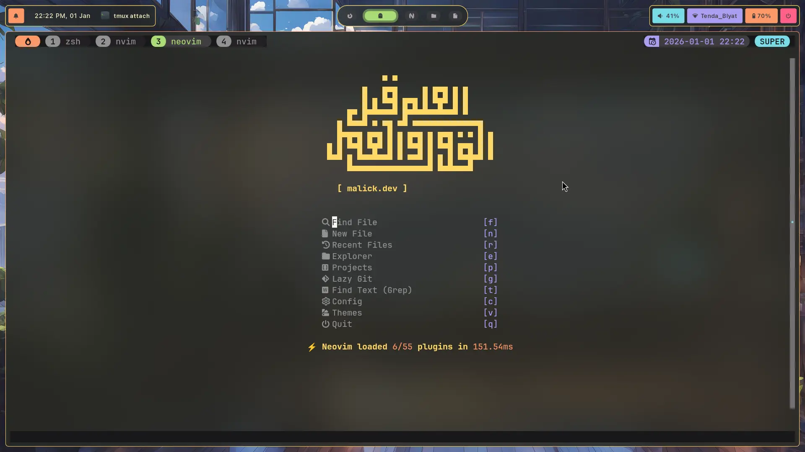
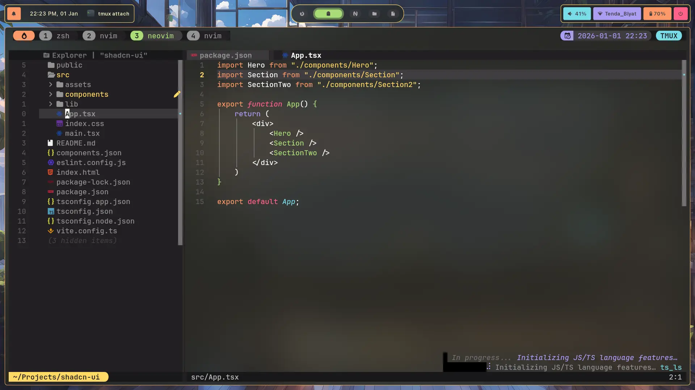

# 🍂 Monokai Neovim config

This is my personal Neovim setup, extracted from my main dotfiles for modularity.
Created for web development mainly and software development using rust "Tauri" and javascript "Electron"

### 🖼️ Preview





### 🔗 Links

- **Main Dotfiles:** [hypr-dotfiles](https://github.com/Malick-Tammal/hypr-dotfiles)

## ⚡ Features

### LSPs

- lua
- javascript / typescript
- css
- html
- tailwindcss
- emmet
- json / jsonc
- rust
- bash / zsh
- hyprls

### Formatters

- lua
- javascript / typescript
- css
- html
- tailwindcss
- emmet
- json / jsonc
- rust
- bash / zsh

and more ...

### 🚀 Quick Install

```bash
git clone https://github.com/Malick-Tammal/monokai-neovim/ ~/.config/nvim
```
